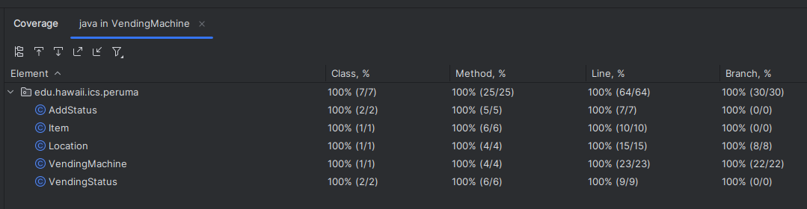

# ics615-junit-testing

> This project demonstrates writing unit tests in Java using IntelliJ and the JUnit 4 framework. It includes a vending machine implementation and focuses on testing functionality and analyzing code coverage.

Files in `VendingMachine/test` directory were created by me, the rest is provided.

